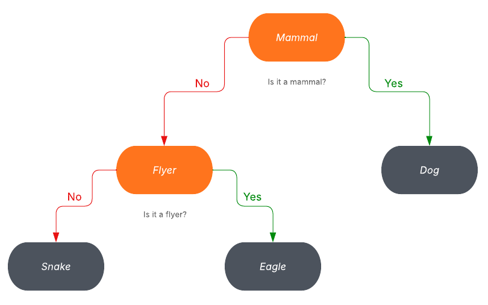

# 🐾 Animal Tree Classifier

A binary tree-based application designed to classify animals based on their characteristics using Yes/No questions. It's a simple but educational console-based project that showcases core data structure concepts.

## 📌 Project Summary

This project uses a **binary tree** where:

- Going **right** means the animal **has** a given characteristic.
- Going **left** means the animal **does not have** the characteristic.

Each **leaf node** in the tree represents a specific animal, and each **internal node** is a question that helps classify the animal.

Additionally, the application includes a **stack-based trace** of the path taken to identify an animal (i.e., the set of characteristics that describe it).

# Skills


## 🧠 Concepts Applied

| Concept           | Description |
|------------------|-------------|
| **Binary Trees**  | Core structure used for the animal classification decision tree. |
| **DFS (Depth-First Search)** | Used to traverse the tree when searching for an animal. |
| **Stack**         | Used to store and print the characteristics (path) that lead to a specific animal. |
| **Recursion**     | Recursively adds, deletes, and traverses tree nodes. |
| **QuickSort**     | Sorts animals alphabetically when listing them. |
| **Tree Persistence** | Saves and loads the tree structure from a text file using preorder traversal. |
| **User Interaction** | Console-based questions and input for a friendly experience. |

---

## 🚀 Features

- ✅ **Search for an animal** and show its characteristics.
- ➕ **Add a new animal** with its distinguishing characteristic.
- ❌ **Delete an animal** from the tree.
- 📃 **List all animals** in alphabetical order.
- 💾 **Save and load** the tree from disk using a plain text file.
- 🧠 Educational tool to learn binary trees and recursion.

---

## 📁 Folder Structure
```
proyectoEstructurasDatos/
├── src/
│ ├── arbol/
│ │ ├── Arbol.java # Binary tree implementation
│ │ ├── Nodo.java # Node class for tree structure
│ ├── pila/
│ │ ├── Pila.java # Stack implementation
│ │ ├── NodoPila.java # Node for the stack
│ ├── Principal.java # Main application logic
├── animales.txt # File to persist the tree structure

```


## 🧪 Example





---

## 💡 How It Works

1. The system starts at the root of the tree.
2. At each node, the user is asked a **Yes/No** question.
3. Based on the answer:
   - `yes` → go to the **right** child.
   - `no` → go to the **left** child.
4. When a **leaf** is reached, the system prints the animal name.
5. The **stack** contains all characteristics traversed to reach this animal.

---

## 🔧 Technologies

- Java 17
- IntelliJ IDEA (recommended IDE)
- Data Structures: Binary Tree, Stack
- Algorithms: DFS, Recursion, QuickSort
